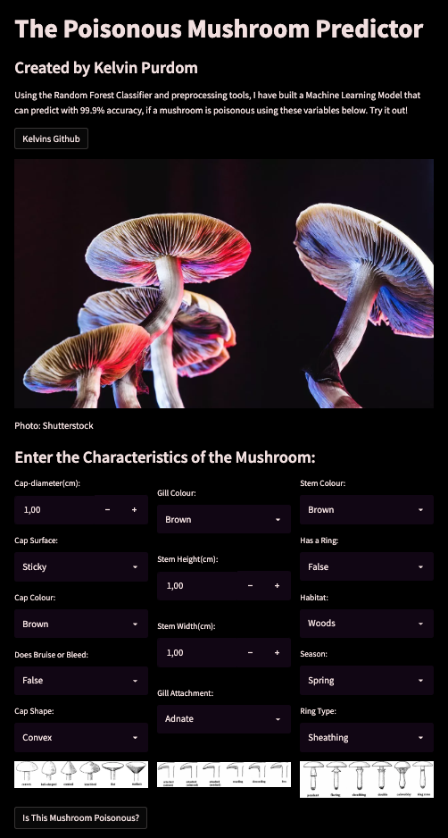

# Data analysis
- Document here the project: MushroomPrediction
- Description: Project Description
- Data Source: kaggle dataset
- Type of analysis: Building a Prediction model with a Random Forest Classifier.

The aim of the project is to predict (using 14 parameters) whether a Mushroom is poisonous. I have tuned the Random Forest Classifier for the optimal hyperperameters to acheive a success rate of 99.9% accuracy.



# Startup the project

The initial setup.

Create virtualenv and install the project:
```bash
sudo apt-get install virtualenv python-pip python-dev
deactivate; virtualenv ~/venv ; source ~/venv/bin/activate ;\
    pip install pip -U; pip install -r requirements.txt
```

Unittest test:
```bash
make clean install test
```

Check for MushroomPrediction in gitlab.com/{group}.
If your project is not set please add it:

- Create a new project on `gitlab.com/{group}/MushroomPrediction`
- Then populate it:

```bash
##   e.g. if group is "{group}" and project_name is "MushroomPrediction"
git remote add origin git@github.com:{group}/MushroomPrediction.git
git push -u origin master
git push -u origin --tags
```

Functionnal test with a script:

```bash
cd
mkdir tmp
cd tmp
MushroomPrediction-run
```

# Install

Go to `https://github.com/{group}/MushroomPrediction` to see the project, manage issues,
setup you ssh public key, ...

Create a python3 virtualenv and activate it:

```bash
sudo apt-get install virtualenv python-pip python-dev
deactivate; virtualenv -ppython3 ~/venv ; source ~/venv/bin/activate
```

Clone the project and install it:

```bash
git clone git@github.com:{group}/MushroomPrediction.git
cd MushroomPrediction
pip install -r requirements.txt
make clean install test                # install and test
```
Functionnal test with a script:

```bash
cd
mkdir tmp
cd tmp
MushroomPrediction-run
```
